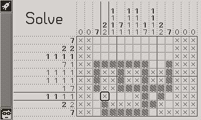

# Sketch, Share, Solve

Sketch, Share, Solve is a [nonogram](https://en.wikipedia.org/wiki/Nonogram) game for the [Playdate](https://play.date). It comes with 99 puzzles included but lets you create your own and share them with your friends.

This game is also on [itch.io](https://r-d-k.itch.io/sketch-share-solve).

